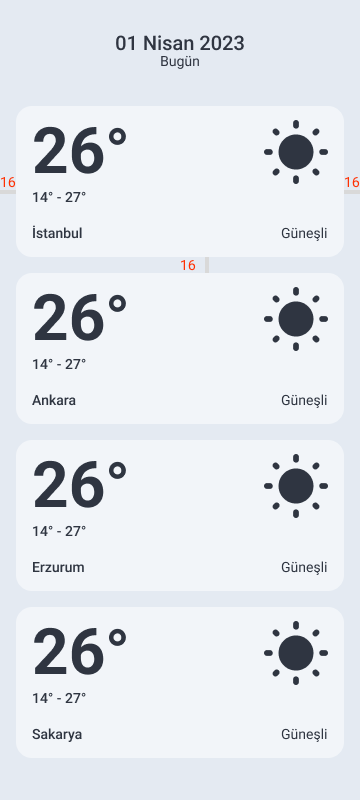
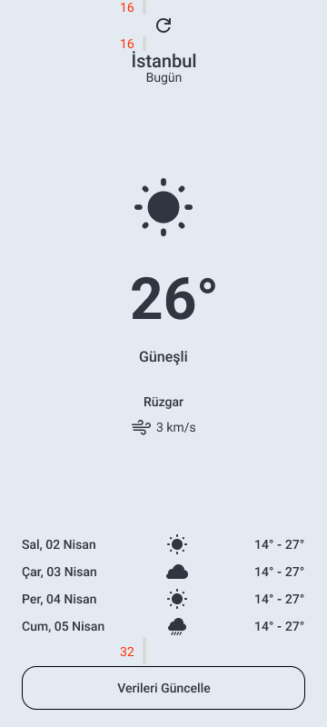

Merhaba,

Task-2 içinde seni Navigation konusu bekliyor olacak.

Navigasyon için farklı yollar uygulayacaksın.

1. Activity - Activity arasında navigasyon ve veri paslama
2. Fragment - Fragment arasında navigasyon ve veri paslama
3. Navigation Components kullanarak Fragment'lar arası navigasyon ve veri paslama
4. Fragment Result API ile veri paslama

Burada navigasyon dışında ayrıca veri taşımayı da yapıyor olacağız.

Önce konular hakkındaki kaynaklara göz atmanda fayda var. Sonrasında başlamak için hazır olacaksın.

Başarılar!

## Konu 
Liste ve detay ekranları arasında veri paslayarak navigasyon/geçiş yapma

## Hedef 
Aşağıdaki UI tasarımları verilen ekranları ConstraintLayout ve ilgili View'ları kullanarak tasarladıktan sonra, 
1. Öncelikle her iki ekranı activity olarak tasarlayıp, ilgili liste item'a tıklanınca detay activity ekranını açacaksın. Detay ekranına giderken ellerin boş gitme. Liste item'da gördüğün tüm dataları da detay ekranına paslayıp, ilgili yerlerde setle.
2. Sonrasında ayrı bir activity oluşturup, bu activity'ye ait 2 ayrı fragment oluştur: Liste ve Detay. Fragment'lar arasında argument setleyerek ilgili dataları paslayarak, navigasyonu tamamla.
3. Projene navigation component'in ekli olduğundan emin olduktan sonra, ayrı bir activity oluştur. Bu activity altında Liste ve Detay için 2 yeni fragment oluştur. Diğer fragment'larındaki kodu kullanabilirsin. Bir nav graph oluştur, kurulumunu yap. Navigation component ve SafeArgs kullanarak bu 2 fragment arasında data paslayarak, navigasyonu tamamla.
4. Son olarak, navigation component için oluşturduğun fragment'lardan detay ekranında bulunan refresh iconuna tıklanınca, rastgele min-max sıcaklık değerleri arasında bir sayıyı, o günün sıcaklık değerine setle. Setlenen değeri, verileri güncelle butonuna basınca Fragment Result API kullanarak Liste fragment'ındaki değeri güncellemek için kullan. Geri geldiğinde (güncelle dedikten sonra otomatik geri de gelebilirsin) atanan son random sıcaklık değeri ilgili item'daki sıcaklık değerine setlenmiş olsun.
Örnek senaryo: Refresh'e tıkladın. 14-27 arası sıcaklık değeleri arasından rastgele 20 seçildi. Detay ekranındaki sıcaklık değeri 20 olarak değiştirildi. Sonra verileri güncelle butonuna basıldı. Result API ile dinlenen sıcaklık değerini setle. Geri geldiğinde dinlediğin sıcaklık değeriyle ilgili item'ın sıcaklık değerini setle. Not: Detaya giderken, seçilen item'a ait unique/eşsiz bir değer(id, index vs.) paslayarak, geri gelince ilgili item'ı bulup, güncelleyebilirsin.

## Kaynaklar 
- [Introduction to activities](https://developer.android.com/guide/components/activities/intro-activities)
- [Create a fragment](https://developer.android.com/guide/fragments/create)
- [Get started with the Navigation component](https://developer.android.com/guide/navigation/navigation-getting-started)
- [Learn Jetpack Navigation - Codelab](https://developer.android.com/codelabs/android-navigation#0)
- [Get results using the Fragment Result API](https://developer.android.com/guide/fragments/communicate#fragment-result)

## UI Tasarım

| List            | Detail                                                               |
| ----------------- | ------------------------------------------------------------------ |
|   |  |

### UI Elements 

Tasarlarken dikkat edeceğin ölçülerin çoğunu bir önceki task'tan alabilirsin. Yeni eklenen boyutlar yukarıdaki görsellerde mevcut. Ayrıca tasarımdaki yeni icon'ları [/icons](./icons) altında bulabilirsin.

